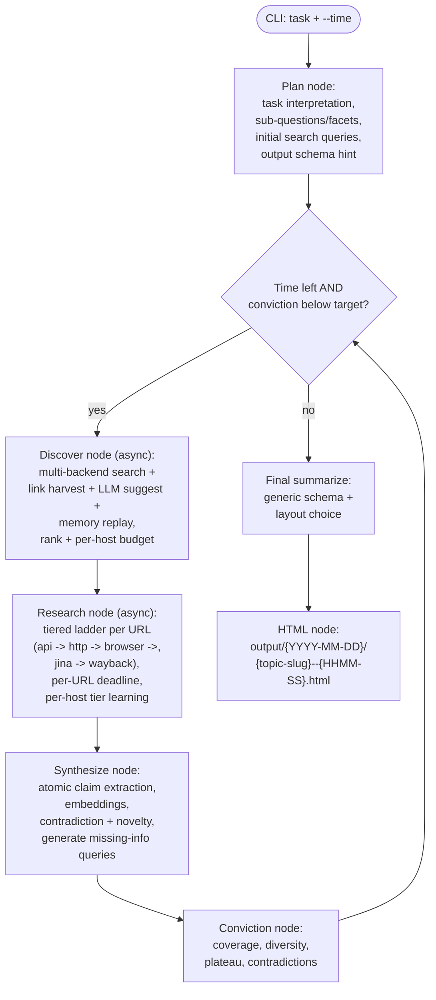
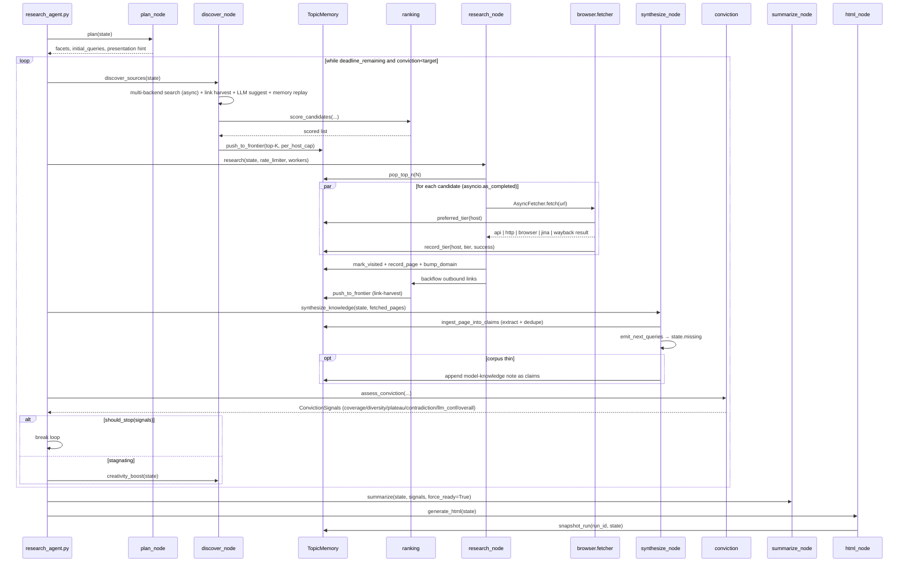
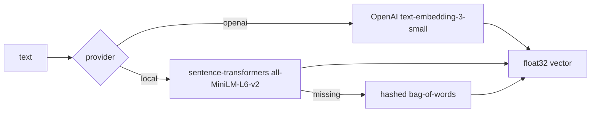
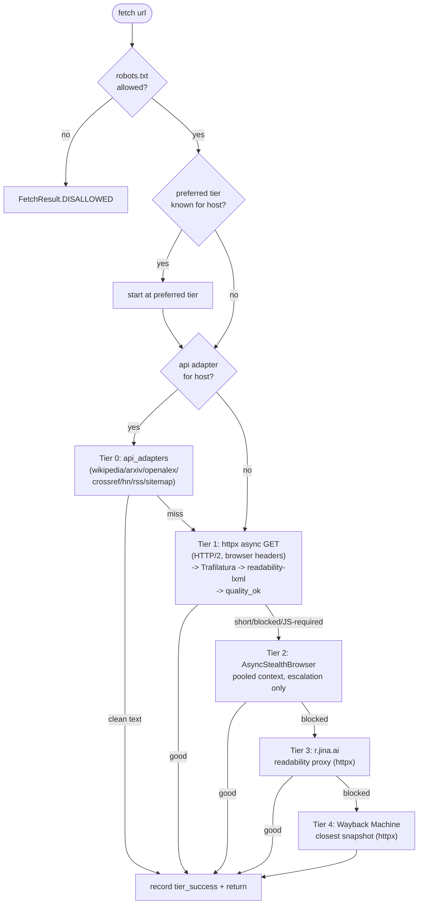

# Architecture

This document explains how LangResearch is built, how data flows through the
system, and the design decisions behind each component. Pair it with the
[README](README.md) (which covers setup and usage).

---

## High-level flow



The orchestrator in [`research_agent.py`](research_agent.py) drives a wall-clock
loop. Each iteration:

1. **Discover** new candidate URLs and rank them into the persistent frontier.
2. **Research** the top-N candidates in parallel under stealth conditions.
3. **Synthesize** atomic claims from the freshly fetched pages, generate
   targeted next-iteration queries, optionally append a model-knowledge note.
4. **Assess conviction** across five signals; stop if the target is met.
5. **Creativity boost** if no progress for several iterations.

When the deadline hits or conviction is high enough, the loop exits and the
**Summarize** node turns everything in `TopicMemory` into structured items,
which the **HTML node** renders.

---

## File layout

```
LangResearch/
  research_agent.py               # CLI + orchestration loop
  requirements.txt
  README.md
  architecture.md
  agent/
    __init__.py
    config.py                     # env-driven knobs (incl. new tier ladder knobs)
    llm.py                        # pluggable LLM provider
    embeddings.py                 # sentence-transformers (+ openai / hash fallback)
    memory.py                     # disk-backed per-topic store
    state.py                      # State dataclass shared across nodes
    utils.py                      # slugify, canonicalize_url, parse_duration, ...
    ranking.py                    # candidate scoring + frontier pushes
    claims.py                     # atomic claim extraction + dedupe
    conviction.py                 # multi-signal stop criteria
    plan_node.py                  # task interpretation + initial queries
    discover_node.py              # frontier expansion + creativity_boost (async)
    research_node.py              # async tiered fetcher + link harvest
    synthesize_node.py            # claim ingestion + next-query generation
    summarize_node.py             # final structured answer
    html_node.py                  # six-layout HTML report (date-organized output)
    search/
      __init__.py                 # multi-backend dispatcher
      duckduckgo.py               # DDG (httpx, async)
      searxng.py                  # SearXNG (env-gated)
      brave.py                    # Brave Search API (env-gated)
    browser/
      __init__.py
      stealth.py                  # AsyncStealthBrowser + ContextPool
      fetcher.py                  # AsyncFetcher: api -> http -> browser -> jina -> wayback
      http_fetch.py               # async httpx wrapper + per-host semaphores
      extract.py                  # Trafilatura -> readability -> strip_html + quality_ok
      api_adapters/
        __init__.py               # try_api(url, client) registry
        wikipedia.py
        arxiv.py
        openalex.py
        crossref.py
        hackernews.py
        rss.py                    # RSS/Atom + sitemap.xml
  memory/                         # runtime, per-topic memory (gitignorable)
  output/                         # runtime, date-organized HTML reports (gitignorable)
```

---

## Data flow per iteration



---

## Component reference

### `research_agent.py` — orchestrator

The CLI entry point.

- Parses `--time` / `--minutes` into a wall-clock deadline (`State.deadline_ts`).
- Creates `TopicMemory(<slug>)` and either initializes or warm-starts it.
- Runs the discover → research → synthesize → assess loop, calling
  `creativity_boost` when [`conviction.is_stagnating`](agent/conviction.py)
  returns true.
- The orchestrator stays sync; each iteration's discover / research phase
  wraps its async work in `asyncio.run(...)`. The Playwright browser is
  constructed inside that scope (only when `BROWSER_DEFAULT != "off"`) and
  lazily started — no Chromium process is spawned for iterations that don't
  need tier-2 escalation.
- Always runs a final `summarize(force_ready=True)` and `generate_html`,
  even if the deadline cuts the loop short.

### `agent/state.py` — `State`

Single dataclass shared across nodes. Key fields:

| Field | Purpose |
| --- | --- |
| `task`, `topic_slug`, `run_id` | Identity. `run_id` keys the per-run snapshot. |
| `interpretation`, `facets`, `initial_queries`, `presentation_hint` | Plan output. |
| `iteration`, `deadline_ts`, `started_ts` | Scheduling. |
| `missing` | Search-friendly phrases for the next discover pass. |
| `new_claims_history` | Sliding window for plateau detection. |
| `creativity_boosts`, `stagnant_streak` | Boost cadence tracking. |
| `last_signals` | Last `ConvictionSignals.to_json()` for the report. |
| `successful_sources`, `failed_sources` | Mirrors of memory's visited-OK / visited-fail lists. |
| `items`, `presentation`, `headline`, `confidence`, `summary_raw`, `sufficient` | Output of the summarizer. |
| `memory: TopicMemory` | The persistent backing store. |
| `research_file` | Path to the per-run `events.jsonl` log. |

### `agent/config.py` — knobs

All tunables live here. Each is overridable via env (`_env_int`, `_env_float`,
`_env_bool` helpers). See [README → environment variables](README.md#environment-variables) for the
full table.

### `agent/llm.py` — pluggable LLM

`llm_chat(prompt, system, temperature) -> str` is the single entry point.
Provider is auto-detected (or forced via `RESEARCH_LLM_PROVIDER`):

| Priority | Provider | Required env |
| --- | --- | --- |
| 1 | MiniMax | `MINIMAX_API_KEY` |
| 2 | OpenAI | `OPENAI_API_KEY` |
| 3 | Anthropic | `ANTHROPIC_API_KEY` |
| 4 | Ollama | `OLLAMA_HOST` |

If none are set, calls return a labelled placeholder; downstream callers
handle that with `is_placeholder` checks. `llm_chat_json` parses fenced or
inline JSON via `utils.extract_json` and returns `None` on failure, so JSON
nodes can fall back gracefully.

### `agent/embeddings.py` — embedding layer



`embed(texts)` never raises; on every failure it falls back one tier.
`cosine` and `cosine_matrix` provide the similarity primitives used by
ranking, claim dedupe, and facet coverage.

### `agent/memory.py` — `TopicMemory`

Disk layout per topic:

```
memory/<topic_slug>/
  meta.json
  frontier.jsonl
  visited.jsonl
  pages/<sha1(url)>.json
  claims.jsonl
  domain_trust.json
  embeddings.npy
  embeddings_index.jsonl
  runs/<run_id>/
    events.jsonl
    state.json
```

`domain_trust.json` schema (extended for per-host tier learning):

```json
{
  "example.com": {
    "ok": 12, "fail": 0, "blocked": 0,
    "tier_success":  {"api": 0, "http": 11, "browser": 1, "jina": 0, "wayback": 0},
    "tier_attempts": {"api": 0, "http": 12, "browser": 1, "jina": 0, "wayback": 0},
    "preferred_tier": "http"
  }
}
```

The fetcher consults `preferred_tier(host)` to start at the right tier on
revisits and calls `record_tier(host, tier, success)` after each attempt.
`preferred_tier` is recomputed as the tier with the highest success ratio
(min 2 attempts), preferring earlier tiers on ties.

Append-only JSONL is rewritten on dedupe (frontier reshape after `pop_top_n`).
The store provides:

- `add_candidate / pop_top_n / has_candidate / is_visited / frontier_size`
- `mark_visited / record_page / read_page / all_pages / successful_urls / failed_urls`
- `bump_domain / domain_trust_score / domain_trust_table / replay_good_urls`
- `record_tier / preferred_tier` (per-host tier learning)
- `add_claim` (with embedding-based dedupe at `CLAIM_DEDUPE_SIM_THRESHOLD`),
  `all_claims`, `claim_count`, `unique_supporting_domains`
- `init_meta`, `begin_run`, `snapshot_run`

Cross-process safety is best-effort (no file locks). The agent is
single-process, so this hasn't been a problem in practice.

### `agent/ranking.py` — frontier ranker

Each candidate gets a composite score:

```
score = w_sim     * cosine(topic_embedding, [title + snippet + url-slug])
      + w_trust   * domain_trust(host)        // from memory's success history
      + w_novelty * exp(-0.35 * host_saturation)
```

Default weights live in `config.RANK_WEIGHT_*`. After heuristic scoring,
`llm_rerank_topk` optionally asks the LLM to score the top-K (12 by default),
and `push_to_frontier` enforces a per-host cap before persisting.

### `agent/search/duckduckgo.py` — DDG scraping

Two endpoints, in order:

1. `https://html.duckduckgo.com/html/?q=...` — primary, parsed with regex.
2. `https://lite.duckduckgo.com/lite/?q=...` — fallback when the HTML
   endpoint returns nothing.

Both go through the stealth Playwright context so DDG sees a normal browser.
Result URLs that are wrapped in DDG's `/l/?uddg=...` redirector are unwrapped.

### `agent/browser/stealth.py` — anti-bot stack (async, pooled)

- `AsyncStealthBrowser`: owns the Playwright `async_api` lifecycle. Maintains
  a small pool of stealth contexts (default 4, recycled every 50 pages) that
  are reused via `async with browser.acquire_context()` instead of being
  created per URL. Each context still uses randomized
  user-agent / viewport / locale / timezone + `playwright-stealth` patches +
  an init script that hides `navigator.webdriver`.
- The browser is **lazily started** inside the first `acquire_context()`
  call so iterations that never need tier 2 don't spawn Chromium at all.
- `StealthBrowser` is kept as a backwards-compatible alias for
  `AsyncStealthBrowser`.
- `HostRateLimiter`: minimum interval between hits on the same host.
  Provides both sync (`wait`) and async (`wait_async`) entry points.
- `RobotsCache`: per-host cached `RobotFileParser`; fail-open if `robots.txt`
  can't be fetched. Provides both sync (`allowed`) and async (`allowed_async`,
  via `asyncio.to_thread`).

`humanize(page)` adds small mouse jitter + scroll before content read; `settle`
(sync) and `settle_async` add a small randomized sleep after navigation.

### `agent/browser/fetcher.py` — `AsyncFetcher.fetch(url)`

Async **tiered ladder** with a strict per-URL wall-clock budget
(`config.URL_TOTAL_DEADLINE`, default 12s). Each tier gets the smaller of its
own timeout and the remaining global budget. After every attempt the
fetcher updates `domain_trust.tier_success/tier_attempts/preferred_tier` so
the next visit to that host *starts at the right tier*.



Per-tier `route` strings persisted into memory: `api:wikipedia`, `api:arxiv`,
`api:openalex`, `api:crossref`, `api:hackernews`, `api:rss`, `api:sitemap`,
`http`, `browser`, `jina`, `wayback`, `robots`, `error`.

### `agent/browser/api_adapters/` — Tier 0 site-specific clients

A registry of small async adapters that bypass HTML entirely for well-known
hosts. Each adapter inspects the URL pattern and either returns an
`AdapterResult` (clean text + title + optional outbound links) or `None`
to let the ladder fall through to Tier 1.

| Adapter | Pattern | Backing API |
| --- | --- | --- |
| `wikipedia.py` | `*.wikipedia.org/wiki/<Title>` | MediaWiki REST extract |
| `arxiv.py` | `arxiv.org/abs/<id>` / `arxiv.org/pdf/<id>` | export.arxiv.org Atom |
| `openalex.py` | `openalex.org/Wxxxx` (incl. `/works/`) | api.openalex.org JSON |
| `crossref.py` | `doi.org/<doi>` / `dx.doi.org/<doi>` | api.crossref.org JSON |
| `hackernews.py` | `news.ycombinator.com/item?id=N` | hacker-news.firebaseio.com |
| `rss.py` | `*.rss` / `*.atom` / `/feed/` / `sitemap*.xml` | feedparser + sitemap parse |

`try_api(url, client)` dispatches in registry order and returns the first
match. Adapters never raise out — any failure surfaces as `None`.

### `agent/browser/http_fetch.py` — Tier 1 async httpx wrapper

`HttpClient` is a context-managed `httpx.AsyncClient(http2=True, ...)` with:

- Realistic Chrome-on-macOS headers (`polite_headers()`).
- A global `asyncio.Semaphore(HTTP_MAX_CONNECTIONS)` and per-host
  `asyncio.Semaphore(HTTP_PER_HOST_CONCURRENCY)` to cap concurrency.
- `get_with_backoff(...)` which retries on 429/5xx with jittered exponential
  backoff, honors `Retry-After`, and short-circuits when the URL's deadline
  is in the past.

One client instance lives for the duration of an iteration's `asyncio.run`,
so TCP/TLS sessions are amortized across hundreds of URLs.

### `agent/browser/extract.py` — content extraction + quality gate

- `_trafilatura_extract` (primary): `favor_recall=True`, `include_tables=True`,
  `include_links/comments=False`. Best for blogs, news, docs, papers.
- `_readability_extract` (fallback): readability-lxml.
- `strip_html` (last resort): plain tag stripper from `agent/utils.py`.
- `quality_ok(text)` (NEW): the gate that decides whether to keep a page or
  escalate to the next tier. Combines length + block-marker substring check +
  prose heuristic (sentence density, alpha-ratio). Replaces the old
  length-only `_is_blocked`.

The result is `ContentExtraction(title, text, links, extractor)` where
`extractor` records which path succeeded (useful for debugging).

### `agent/plan_node.py` — `plan(state)`

Produces (via a strict-JSON LLM call):

- `interpretation` — one paragraph.
- `facets[]` — 6–10 concrete sub-questions whose union answers the task.
- `initial_queries[]` — 6–10 varied DuckDuckGo queries.
- `presentation` hint — `{layout, title, headline, columns, sections}`.
- `plan_steps[]` — short numbered narrative for the report.

A deterministic fallback (generic facets + `task` variants for queries) keeps
the agent functional when no LLM is configured.

### `agent/search/` — multi-backend search dispatcher

The discover node now queries any combination of available backends in
parallel via a single `search(client, query)` entry point:

- `duckduckgo.py` (always on, keyless) — `httpx` GET against
  `html.duckduckgo.com/html/`, with `lite.duckduckgo.com/lite/` fallback.
  No Playwright on the search path.
- `searxng.py` (env-gated by `RESEARCH_SEARXNG_URL`) — JSON endpoint.
- `brave.py` (env-gated by `RESEARCH_BRAVE_API_KEY`) — Brave Search REST.

The dispatcher fans the query out across enabled backends concurrently,
merges hits by canonical URL (first-seen wins), and returns a single
de-duplicated `SearchHit` list.

### `agent/discover_node.py` — `discover_sources(state)`

Builds a candidate pool from four sources, then ranks and pushes:

1. **Multi-backend search** — DDG always; SearXNG/Brave when configured.
   Queries are derived from `state.missing`, the first iteration's
   `initial_queries`, and `state.facets`, and run concurrently per query.
2. **Link harvest** — outbound links from every page already in
   `memory.all_pages()`.
3. **LLM suggestions** — the original "give me 6 reliable URLs" prompt,
   only triggered when the frontier is small.
4. **Memory replay** — already-visited URLs from trusted domains for warm
   starts.

Pool → `score_candidates` → optional `llm_rerank_topk` → `push_to_frontier`.

`creativity_boost(state)` is also defined here. When the agent stagnates it
asks the LLM for radically different angles (contrarian framings, different
time windows, niche outlets, non-English, methodological), then injects them
into `initial_queries` and `missing` so the next discover pass changes shape.

### `agent/research_node.py` — `research(state, rate_limiter, workers)`

- `pop_top_n(POP_PER_ITERATION, per_host_cap)` from the frontier.
- Opens one shared `HttpClient` and (only if `BROWSER_DEFAULT != "off"`) one
  fresh `AsyncStealthBrowser` for the iteration. The browser is *lazily
  started*: no Chromium process is spawned until tier 2 actually fires.
- `asyncio.as_completed` drains the `AsyncFetcher.fetch` tasks while
  respecting a global `asyncio.Semaphore(workers)` and per-host concurrency
  caps inside the `HttpClient`. Each completed result is persisted to memory
  via `asyncio.to_thread(_record_result, ...)` so JSONL writes don't block
  the event loop.
- Successful pages' outbound links are scored and back-flowed into the
  frontier the same iteration — this is what makes discovery
  self-sustaining.

The loop is deadline-aware: if `state.time_left() <= 0` while tasks are in
flight, remaining work is cancelled. Browser and HttpClient are cleanly
closed when the iteration's `asyncio.run` returns.

### `agent/claims.py` — atomic claims

`extract_claims_from_page` asks the LLM for up to `MAX_CLAIMS_PER_PAGE`
self-contained factual statements + supporting quotes. Each claim is embedded
and offered to `TopicMemory.add_claim`, which:

- compares cosine similarity against existing claim embeddings;
- merges when sim >= `CLAIM_DEDUPE_SIM_THRESHOLD` (`0.86`), bumping
  `support` and adding the new source URL;
- otherwise creates a new claim record.

`facet_coverage(memory, facets)` answers, for each facet, "how many claims
support it and from how many distinct domains?" — directly powering the
`coverage` and `diversity` conviction signals.

### `agent/conviction.py` — `assess_conviction(...) -> ConvictionSignals`

Five signals into one number:

| Signal | Computation |
| --- | --- |
| `coverage` | Fraction of `facets` covered by ≥2 distinct supporting domains. |
| `diversity` | Distinct supporting domains, normalized vs `MIN_DOMAINS_FOR_READY`. |
| `plateau` | 1.0 when avg new-claims/iter over `PLATEAU_WINDOW` falls below `PLATEAU_NEW_CLAIMS_THRESHOLD`. |
| `contradiction` | Fraction of claims marked as contradicting another. |
| `llm_confidence` | LLM judges the corpus from a sample of claims + facet summary. |

```
overall = 0.35*coverage + 0.20*diversity + 0.15*plateau + 0.30*llm_conf - 0.20*contradiction
```

`should_stop(signals)` returns true when `overall >= CONVICTION_TARGET` and
`coverage >= COVERAGE_TARGET`, *or* when the agent has clearly plateaued
with sufficient coverage and domain diversity.
`is_stagnating(history)` triggers `creativity_boost` after
`STAGNATION_ITERATIONS` near-zero rounds.

### `agent/synthesize_node.py` — claim ingestion + next queries

For every fetched page this iteration:

1. `ingest_page_into_claims` runs claim extraction + dedupe.
2. Adds totals to `state.new_claims_history` (used by `plateau`).

Then asks the LLM for next-iteration search queries targeted at facets with
weak coverage; results land in `state.missing` and `state.initial_queries` to
feed the next `discover_sources` pass.

When the corpus is thin (< 5 pages so far), it appends a model-knowledge
"note" — those go through claim extraction too, so the model's own
context contributes to coverage just like any other source (with explicit
provenance: source URL is `model-note:<run_id>:<iter>`).

### `agent/summarize_node.py` — final structured answer

Builds a single prompt containing:

- task, interpretation, facets;
- conviction signals;
- the OK source list (for citation grounding);
- the full claim list with `[support=N; domains=...]` annotations;
- top page excerpts, sorted by `text_len` descending.

The summarizer classifies a **report type** and may return **groups** for
categorized result sets, on top of the generic item schema:

```json
{
  "status": "ready" | "need_more_info",
  "confidence": 0.0,
  "report_type": "qa_list|financial|analysis|comparison|entity_list|ranked|timeline|narrative|general",
  "missing": ["..."],
  "presentation": {
    "layout": "cards|table|ranked_list|comparison|narrative|timeline",
    "title": "...",
    "headline": "...",
    "columns": ["..."],
    "sections": ["..."]
  },
  "groups": [
    { "name": "Category / tab", "summary": "...", "items": [ /* item shape below */ ] }
  ],
  "items": [
    {
      "name": "...",
      "headline": "...",
      "question": "for qa_list",
      "answer": "for qa_list",
      "company_tags": ["for qa_list"],
      "frequency": "for qa_list",
      "difficulty": "for qa_list",
      "key_points": ["..."],
      "metrics": {"for financial/analysis": "Revenue: $60.9B"},
      "pros": ["for comparison"],
      "cons": ["for comparison"],
      "verdict": "for comparison",
      "evidence": ["for analysis"],
      "details": {"k": "v"},
      "body": "prose for narrative/analysis/timeline",
      "when": "for timeline only",
      "sources": ["urls from the OK list"]
    }
  ]
}
```

**Report type** drives both how much detail the prompt asks for and which
template renders the result. The `report_type`-specific item fields
(`question`/`answer`, `metrics`, `pros`/`cons`/`verdict`, `evidence`) are all
optional — renderers pick what they need and ignore the rest. When `groups`
is present, the matching renderer shows category **tabs**; when it's absent,
items render flat exactly as before. `state.items` is always kept populated
(flattened from groups when needed) so the side panels and run snapshots are
unchanged.

How much of the corpus is fed to the summarizer is controlled by
`SUMMARY_MAX_CLAIMS`, `SUMMARY_MAX_PAGE_EXCERPTS`, and
`SUMMARY_EXCERPT_CHARS`, with `SUMMARY_PROMPT_MAX_CHARS` as a hard cap so a
large corpus can't overrun the model context.

### `agent/html_node.py` — report rendering

Rendering happens in two layers. `_render_results_section` first checks
`state.report_type` against the `REPORT_TYPES` dispatch map; if there's a
dedicated template it uses it, otherwise it falls back to the six base
`LAYOUTS` keyed off `presentation.layout`.

**Base layouts** (share a CSS theme):

- `cards` — responsive grid of per-item cards.
- `table` — tabular comparison by configurable columns.
- `ranked_list` — ordered list with rank badge.
- `comparison` — pivoted side-by-side, attributes as rows.
- `narrative` — long-form sections with H2/H3, paragraphs, callouts.
- `timeline` — chronologically ordered events keyed by `when`.

**Report-type templates** (richer, topic-tailored):

- `qa_list` — collapsible Q&A entries with difficulty / frequency / company
  badges; grouped into category **tabs** when `state.groups` is present.
- `financial` — a KPI callout strip (pulled from item `metrics`) plus
  sectioned report bodies (Valuation, Fundamentals, Segments, Risks, …).
- `analysis` — narrative sections with an explicit Evidence block per finding.
- `comparison` (v2) — the pivoted attribute matrix *plus* per-option
  pros/cons cards and a verdict callout.

**Tabs are CSS-only.** `_render_tabs` emits one hidden radio input per group,
a label strip, and one panel per group; `:checked ~ .tab-panel:nth-of-type(N)`
rules in `_page_css()` show the active panel. This keeps the report a single
self-contained file that works when opened directly from disk (no JS).

The renderer is forgiving about item key names (`_item_get` consults
`details`, plus a small synonym table) so the LLM doesn't need a perfect
schema match. Side panels expose plan, facets, sources used, blocked sources,
run stats (including report type and tab count), conviction signals, and
still-missing info — making the report self-documenting.

### Output path layout

The default layout is **date-first, flat HTML**:

```
output/
  2026-05-24/
    compare-lfp-vs-nmc-battery-chemistries--1209-23.html
    high-conviction-tech-stocks-2026--1430-05.html
  2026-05-25/
    what-is-glp-1-side-effects--1015-44.html
```

`_parse_run_id()` pulls `YYYY-MM-DD` and `HHMM-SS` out of
`state.run_id` (which already has the form `YYYYMMDD-HHMMSS-<hex>`), and
`_resolve_output_path()` assembles `output/<YYYY-MM-DD>/<slug>--<HHMM-SS>.html`.

`RESEARCH_OUTPUT_LAYOUT=per_run_dir` switches back to the legacy
`output/<topic_slug>/<run_id>/index.html` layout for backwards compatibility.

The final `state.to_snapshot()` is persisted (separately) to
`memory/<topic_slug>/runs/<run_id>/state.json`; intermediate event logs live
at `memory/<topic_slug>/runs/<run_id>/events.jsonl`. Memory is kept entirely
distinct from the output tree so wiping `output/` never affects the agent's
accumulated knowledge.

---

## Why this design

A few decisions are worth explaining:

1. **Persistent per-topic memory.** Conviction is hard to reach in one pass.
   By persisting frontier, claims, and domain trust on disk per topic, every
   subsequent run on the same topic starts smarter than the last — and a long
   run that's interrupted can be resumed cheaply.
2. **Atomic claims + embedding dedupe** beat raw page concatenation. Without
   dedupe, multiple sources reporting the same fact would balloon the corpus
   and bias the summarizer; with it, repetition becomes corroboration
   (`support++`) which is exactly what conviction wants to measure.
3. **Multi-signal conviction.** A single LLM "is this enough?" call is
   notoriously over-confident. Splitting conviction into
   coverage/diversity/plateau/contradiction/judge keeps the agent honest:
   you can't get a high overall score from one chatty source.
4. **Frontier + per-host cap + back-flow.** This combination is what makes
   discovery genuinely unlimited. Outbound links from a Yahoo Finance page
   feed straight back into next iteration's ranking, and the per-host cap
   prevents one domain (or a whole syndication network) from drowning out
   primary sources.
5. **Tiered fetch ladder (api → http → browser → jina → wayback).** HTTP-first
   is faster, lower-RAM, and less detectable than a headless browser. Most
   pages return clean HTML to a polite httpx GET, and the well-known research
   sources (Wikipedia, arXiv, OpenAlex, Crossref, HN, RSS, sitemap) get
   bypassed to clean JSON/XML APIs entirely. Playwright stealth is kept as an
   escalation tier so JS-heavy or anti-bot pages still work, but it is no
   longer the default — which removes Chromium memory pressure as the
   dominant multi-day failure mode.
6. **Per-host tier learning.** Each host remembers which tier worked and
   starts there next visit. A site that's clean HTML on first visit costs
   only an httpx round-trip on visit #2; a JS-app that needed the browser
   skips three failed tiers next time.
7. **Strict per-URL deadlines.** A single bad URL cannot stall the agent.
   `RESEARCH_URL_TOTAL_DEADLINE` (12s default) is shared across all tiers,
   and each tier clips its timeout to whatever budget remains.
8. **Pluggable LLM, local embeddings, free search.** The agent must run
   end-to-end with any single API key (or just a local Ollama). Local
   embeddings and DDG-via-httpx remove the biggest hidden costs and the
   biggest single-vendor dependencies from a multi-hour run. SearXNG and
   Brave are env-gated, optional upgrades.
9. **Generic schema, six layouts.** "Stocks, ranked by conviction" was the
   original demo, but the right shape for "compare LFP vs NMC" is a
   comparison table, for "history of GLP-1" is a timeline, and for "what is
   X?" is narrative. Letting the LLM pick from a finite menu — instead of
   forcing one schema — keeps the report appropriate to the question.

---

## Extending

Common extension points:

- **New layout** — add a renderer to `html_node.LAYOUTS` and mention it in
  the summarizer prompt's enum. The renderer receives `(items, columns, sections)`.
- **New LLM provider** — add a `_call_<name>` function in `agent/llm.py` and
  register it in `_DISPATCH`; auto-detection slots in via `_detect_provider`.
- **New search backend** — add `agent/search/<name>.py` returning a list of
  `SearchHit`; call it from `discover_node._gather_search_candidates` alongside
  DDG.
- **New conviction signal** — extend `ConvictionSignals`, compute it in
  `assess_conviction`, and weight it into `overall`.
- **Different ranking** — adjust `RANK_WEIGHT_*` env vars, or rewrite
  `score_candidates` (e.g. to score against per-facet embeddings instead of
  one combined topic embedding).
